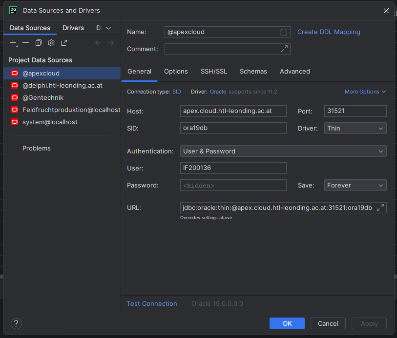
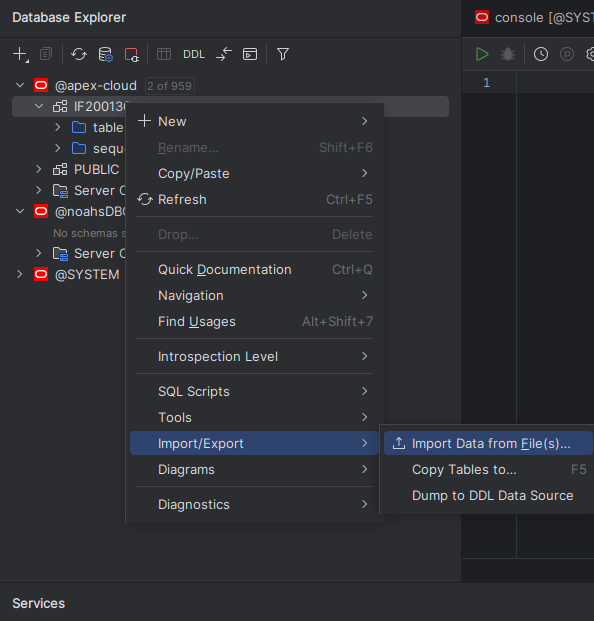

# CSV Import

## First Step
Hier sieht man wie die Verbindung von der IDe zu dem Apex cloud server aussieht. Als user hab ich meine Daten angegeben.

## Second Step 
Rechtsklicke den Host, wo du die csv Dateien importen willst, dann gehst du über **Import/Export** und wählst **Dump to DDL Data Source** aus.  

## Third Step
Hier kannst du nun anpassen wie man seine csv Daten in seine Datenbank einfügen will.

## Picture after Third Step
Das sollte rechts unten in ihrer IDE erscheinen nach cdm einfügen der Tabellen. 

## Picture Csv Import (Datagrip)
hier nochmal die Ansicht von Datagrip, dass sich die Daten in den Tabellen gespeichert haben.

## Update 22.11.2023
Nach dem Feedback vom Herr Professor Anzenberger haben wir eingie Sachen in diesem AA verändert. Durch das Feedback gaben wir es so beschlossen, dass wir alle Daten in eine Tabelle hineinpacken, das es einfacher ist zum inserten von CSv Daten.
### Derzeitiges Star schema

