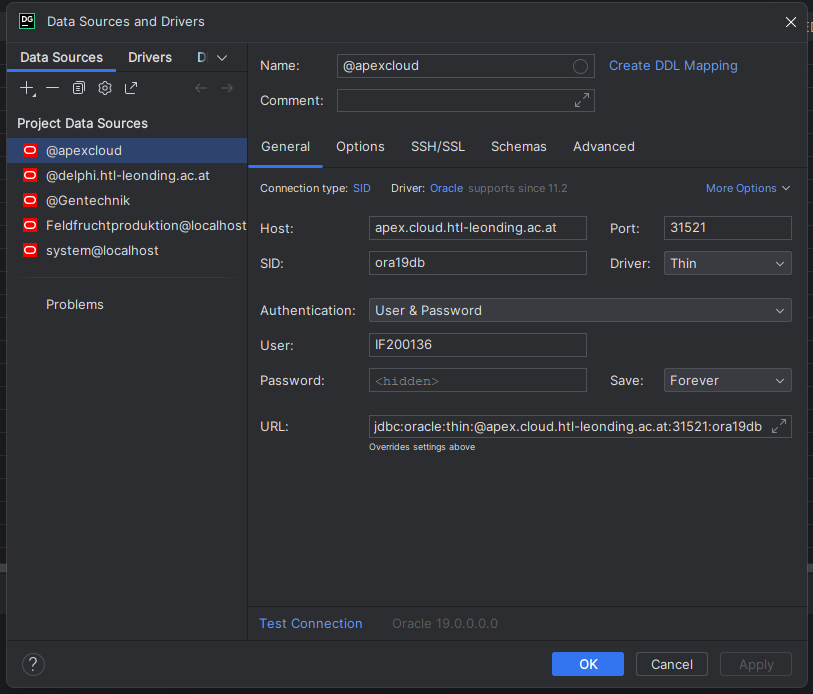

# Feldfruchtproduktion

**Team**
* Noah Grundner
* Lorenz Kasiezcka

**Verwendete Technologien**
* Database
  * Apex Cloud
* IDE
  * VSCode
  * Intellij
  * Datagrip


## Aufgabe 1

---

### Bericht über die Metadaten
In diesem kurzem Bericht haben wir als Team mit dem Thema Feldfruchtproduktion beschäftigt. Wir haben daten von 2022 bi 1975 gefunden. Wir können auch dovon ausgehen, dass wir daten von anderen Ländern kommen kann.

*Datenverantwortliche Stelle:* Bundesamt für Eich- und Vermessungswesen

*Kontaktseite der datenverantwortlichen Stelle:* https://www.bev.gv.at/Das-BEV/Kontakte-und-Standorte.html

*Veröffentlichende Stelle:* BEV


### Kurzbeschreibung der Daten
Der Inhalt der Daten beinhaltet: 
+ Weizen
+ Gerste
+ Körnermais inkl. CCM
+ Kartoffeln
+ Zuckerrüben
+ Raps und Rübsen
+ Sojabohnen
+ Land

Die Maßeinheiten der Daten sind alle in Tonnen beschrieben. 

### Fragestellung
Wie ist der Unterschied an Wachstum über die Jahre der Feldfruchtproduktion?

Wie viel wurde in den Jahr an Feldfruchtproduktion, von einer spezifischen Sorte, geerntet?

## Aufgabe 2

---

### Star Schema


### Faktentabelle

* CropProduction

### Updated 22.11.2023
#### Jetzt Zahlen in Faktentabelle
#### + andere aufforderungen von Prof. Anzenberger erfüllt

## Aufgabe 3

--- 

````sql
DROP TABLE CROPPRODUCTION;

CREATE TABLE CROPPRODUCTION
(
    CROP_PRODUCTION_ID Number GENERATED BY DEFAULT on null AS IDENTITY (START WITH 3000),
    TIME_ID            Number,
    GEOGRAFY_ID        Number,
    CROP_ID            Number,
    WHEAT Number,
    BARLEY Number,
    GRAIN_CORN_INCLUDING_CCM Number,
    POTATOES Number,
    SUGARBEET Number,
    RAPESEED_AND_TURNIPS Number,
    SOYBEANS Number,
    PRODUCTION_YEAR Number NOT NULL,
    COUNTRY VARCHAR(200) NOT NULL,
    CONSTRAINT PK_CROP_PROD PRIMARY KEY (CROP_PRODUCTION_ID)
);
GRANT SELECT ON PRODUCTION_YEAR TO anzenberger;
GRANT SELECT ON GEOGRAFY TO anzenberger;
GRANT SELECT ON CROPPRODUCTION TO anzenberger;
````

## Aufgabe 4

### Picture Connection Datagrip (Apex Cloud)


### Picture Csv Import (Datagrip)


### Picture Table Overview Datagrip



### Update 22.11.2023
Nach dem Feedback vom Herr Professor Anzenberger haben wir eingie Sachen in diesem AA verändert. Durch das Feedback gaben wir es so beschlossen, dass wir alle Daten in eine Tabelle hineinpacken, das es einfacher ist zum inserten von CSv Daten.
#### Derzeitiges Star schema


#### Insert Into DWH

<!--> TODO: Insert into DWH<--->

## Aufgabe 5

1. Gruppenfunktion über alle Dimensionen mit CUBE
2. ein Ranking
3. Pivot Auswertungen
    1. alle Paare der Dimensionen
    2. alle Gruppen -> ein Pivotstatement -  Spalten: Jahre / Zeilen: aussagekräftige Dimension